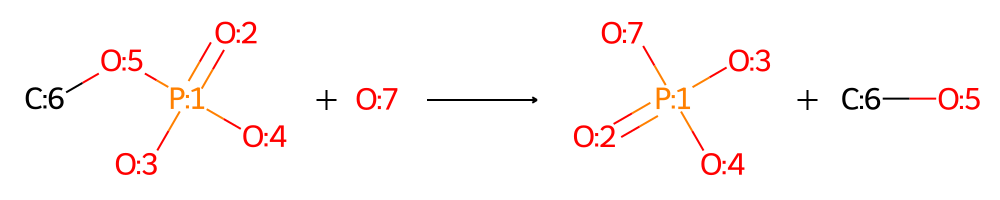

# ECI-data
ECI stands for Enzyme-Chemical Interaction. The problem formulation is as below:


**The high goal of ECI is to develop models which could use data of the activity of multiple compounds on related enzymes to enhance predictions of the activity of these compounds on the focused enzyme.** 

The problem formulation of ECI is similar to drug-target interaction(DTI), but there are some significant differences between the two:  DTI is a matrix completion problem where the problem is information insufficiency. ECI is a matrix factorization problem where the problem is information overload.

The repository contain datasets suitable for ECI tasks come from the literature performing high-throughput experiments or large-scale characterization. It also contains the data curation codes and useful tools for biological and chemical data collation and text and image processing.


## File Organization

Refer to the `tree.txt` for details.

| directory | description                                                  |
| --------- | ------------------------------------------------------------ |
| datasets  | the *pure* datasets, with the four classical files listed in the **Data Format** part. |
| process   | parse functions, the raw data files and the *long* datasets. In each datasets, the `enzymes_long.csv` and `chemicals_long.csv` are provided, if available. In the two files, the descriptors for enzymes and chemicals from the original paper are provided for reproducing the data analysis in the original paper. |
| util      | utility functions for data processing.                       |
| media     | Media files used in `README.md`.                             |


## Data Format

Four files are provided for each dataset.

| file            | description                                                  |
| --------------- | ------------------------------------------------------------ |
| `enzymes.csv`   | Name, Sequence, pdb and other properties                     |
| `chemicals.csv` | Name, SMILES, sdf file path and other properties             |
| `activity.csv`  | raw values from literature                                   |
| `metadata.json` | the original data collection strategy, modeling strategy, and enzyme catalysis issues to be explored |


## Metadata description

This repository not only focuses on the data itself, but also focuses on the scientific or engineering issues to be explored, the original data collection strategy and modeling strategy. The definition of each entry is listed in `util\metadata.json` . And the `metadata.json` in each dataset is edited manually after carefully reading the original paper.

The entries of meta data could be divided into five categories.

| Type       | Description                                                  |
| ---------- | ------------------------------------------------------------ |
| basic      | Basic information of the literature, the enzymes family, the substrate library and the activity definition. |
| statistic  | Statistics calculated from the data tables.                  |
| experiment | Experimental details of the enzymes' production and activity assay. |
| model      | Model constructed in the original paper to rationalize the experimental results |
| process    | data process implemented here                                |


## Datasets

Here are 2 datasets now. Run the code to make the statistical table below, as the `statistic.csv` file.

```
python main.py -s
```

| Dataset  |                       Description                       |                  Reaction                  |  #E  |  #C  |  #A   |
| :------: | :-----------------------------------------------------: | :----------------------------------------: | :--: | :--: | :---: |
| esterase | A broad ester library to a broad esterase  collections. |  | 147  |  96  | 14112 |
|  hadsf   |          Broad phosphate to broad phosphatase           |        | 216  | 167  | 36072 |
|          |                                                         |                                            |      |      |       |
|          |                                                         |                                            |      |      |       |


## Data Curation

We recommend that you install the python packages by conda.

```
conda create -n eci_data python=3.9
conda install --yes --file requirements
```

Run the code to make a test.

```
python main.py -t [-v]
```

For a new dataset, run the code to generate the directory and  `parse_[dataset_name].py`  and `metadata.json` files.

```shell
python main.py -n [dataset_name] [-v]
```

 After collecting the raw data files and editing the `parse_[dataset_name].py` file, run

```
python main.py -n [dataset_name] -o [-v]
```

The `main.py` will call the `parse()` function in the `parse_[dataset_name].py` to curate the data. Feel free to change the code in `parse_[dataset_name].py` and output finally the desired files.

The operation of accessing the online server, such as submitting a task to Swiss-model, needs to wait for a period of time before accessing it to obtain content. Run the following command to update the table information and download files.

```python
python main.py -o [dataset_name] [-v]
```

As a text file, one could edit `metadata.json` at any moment.


## Related Sources

A very good beginning for ECI problem. A similar work based on different starting point:

[1] [samgoldman97/enzyme-datasets: Enzyme datasets used to benchmark enzyme-substrate promiscuity models (github.com)](https://github.com/samgoldman97/enzyme-datasets)

A very good introduction to DTI problem:

[2] [alizat/Chemogenomic-DTI-Prediction-Methods: Algorithms for prediction of drug-target interactions via computational (chemogenomic) methods (github.com)](https://github.com/alizat/Chemogenomic-DTI-Prediction-Methods)

